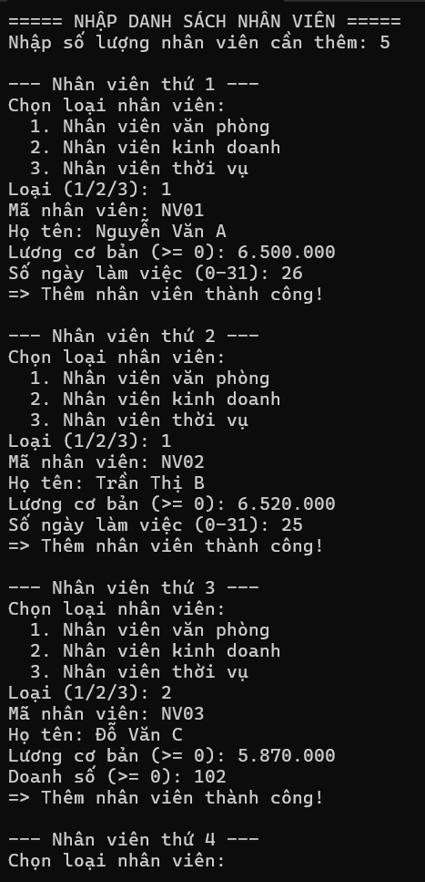
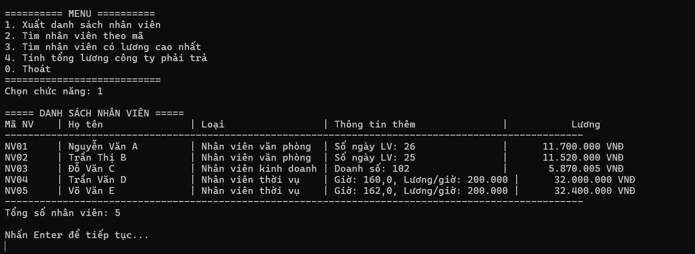
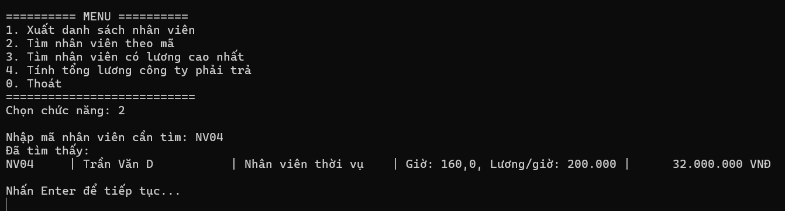
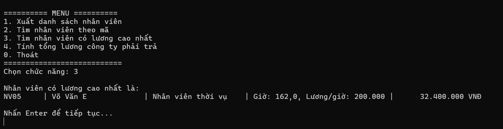
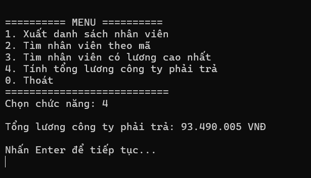
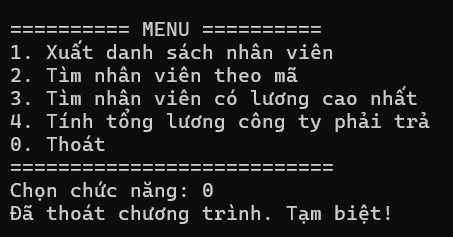

# BTLOP - 16.09.2026 - Quản Lý Nhân Viên - Ứng dụng Console C#

## Thông tin sinh viên
- Họ tên: Võ Ngọc Tuyết Nhung
- MSSV: 49.01.103.058
- Lớp: 49.01.103.058

## Mô tả
Ứng dụng Console C# quản lý nhân viên, áp dụng các kiến thức về Class, Property, Constructor, Encapsulation, Kế thừa và Đa hình.
Chương trình cho phép nhập danh sách nhân viên gồm nhiều loại khác nhau (văn phòng, kinh doanh, thời vụ), mỗi loại có công thức tính lương riêng, sau đó cung cấp các chức năng tra cứu và thống kê trên toàn bộ danh sách mà không cần kiểm tra nhân viên thuộc loại nào.

## Công nghệ sử dụng
- Ngôn ngữ: C# (.NET)
- Loại ứng dụng: Console Application
- Không sử dụng cơ sở dữ liệu (dữ liệu nhập trực tiếp khi chạy chương trình)

## Các lớp trong chương trình

| Lớp | Quan hệ | Công thức tính lương |
|-----|---------|----------------------|
| `NhanVien` | Lớp cha | Lương cơ bản |
| `NhanVienVanPhong` | Kế thừa `NhanVien` | Lương cơ bản + Số ngày làm việc × 200.000 |
| `NhanVienKinhDoanh` | Kế thừa `NhanVien` | Lương cơ bản + 5% × Doanh số |
| `NhanVienThoiVu` | Kế thừa `NhanVien` | Số giờ làm × Lương theo giờ |

## Chức năng chính

### Nhập danh sách nhân viên
Nhập tối thiểu 5 nhân viên, mỗi nhân viên chọn 1 trong 3 loại. Chương trình kiểm tra hợp lệ dữ liệu ngay khi nhập: mã nhân viên không được trùng hoặc để trống, lương và doanh số không được âm, số ngày làm việc phải trong khoảng 0–31.



### Menu chức năng

```
========== MENU ==========
1. Xuất danh sách nhân viên
2. Tìm nhân viên theo mã
3. Tìm nhân viên có lương cao nhất
4. Tính tổng lương công ty phải trả
0. Thoát
===========================
```

#### 1. Xuất danh sách nhân viên
Hiển thị toàn bộ nhân viên dưới dạng bảng. Mọi loại nhân viên dùng chung một định dạng cột nên bảng luôn thẳng hàng dù danh sách trộn lẫn nhiều loại. Cột "Thông tin thêm" tự động thay đổi nội dung theo từng loại (số ngày làm việc, doanh số, hoặc số giờ và lương theo giờ).



#### 2. Tìm nhân viên theo mã
Tra cứu nhân viên theo mã, không phân biệt chữ hoa/thường. Nếu không tìm thấy, chương trình báo rõ mã không tồn tại.



#### 3. Tìm nhân viên có lương cao nhất
So sánh lương giữa tất cả nhân viên chỉ thông qua phương thức `TinhLuong()`, không dùng `if`/`switch` để phân loại nhân viên.



#### 4. Tính tổng lương công ty phải trả
Cộng dồn lương của toàn bộ nhân viên trong danh sách, cũng chỉ dựa vào `TinhLuong()`.



#### 0. Thoát chương trình




## Cách chạy
1. Mở file `QLNhanvien.sln` bằng Visual Studio.
2. Build solution (Ctrl+Shift+B).
3. Chạy chương trình (Ctrl+F5).
4. Nhập số lượng nhân viên (tối thiểu 5) và thông tin từng nhân viên theo hướng dẫn
   trên màn hình.
5. Chọn chức năng từ menu để sử dụng, nhập `0` để thoát.
