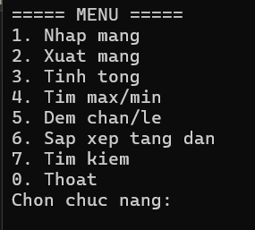
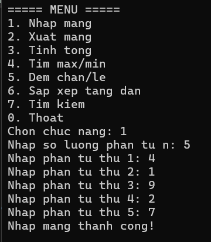
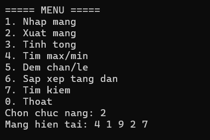
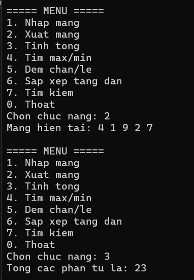
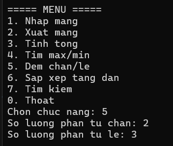
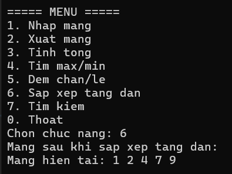
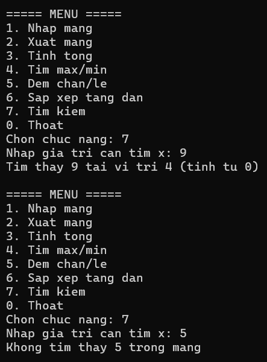
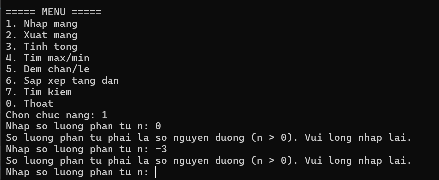

# Lab 02 - Quản lý mảng số nguyên bằng Console

## Thông tin sinh viên
- Họ tên: Võ Ngọc Tuyết Nhung
- MSSV: 49.01.103.058
- Lớp: 49.01.SPTIN.A

## Mô tả
Chương trình Console C# quản lý một mảng số nguyên. Chương trình hiển thị menu để người dùng lựa chọn chức năng, thực hiện xong sẽ quay lại menu cho đến khi người dùng chọn thoát.

## Công nghệ sử dụng
- C# Console App
- .NET (Visual Studio)

## Chức năng
- Nhập mảng (nhập số lượng phần tử n, n phải là số nguyên dương, sau đó nhập từng phần tử)
- Xuất mảng
- Tính tổng các phần tử
- Tìm giá trị lớn nhất và nhỏ nhất
- Đếm số phần tử chẵn / lẻ
- Sắp xếp mảng tăng dần
- Tìm kiếm một giá trị trong mảng, in vị trí xuất hiện đầu tiên
- Thoát chương trình

## Cách chạy
1. Mở file `.sln` bằng Visual Studio
2. Build solution
3. Chạy project (F5 hoặc Ctrl+F5)
4. Chọn chức năng theo menu hiển thị trên màn hình Console

## Xử lý dữ liệu nhập
- Nhập sai kiểu dữ liệu (ví dụ nhập chữ vào menu) không làm chương trình dừng bất thường, chương trình sẽ báo lỗi và yêu cầu nhập lại.
- Số lượng phần tử `n` phải là số nguyên dương (n > 0); nếu nhập 0 hoặc số âm, chương trình yêu cầu nhập lại.
- Các chức năng xử lý trên mảng (xuất mảng, tính tổng, tìm max/min, đếm chẵn/lẻ, sắp xếp, tìm kiếm) chỉ thực hiện được sau khi đã nhập mảng; nếu chưa nhập mảng, chương trình sẽ thông báo và không thực hiện.

## Hình ảnh màn hình

### Menu chương trình

### Nhập mảng

### Xuất mảng

### Tính tổng

### Giá trị min và max

### Số lượng phần tử chẵn và lẻ

### Sắp xếp tăng dần

### Tìm kiếm

### Xử lý nhập sai (n <= 0, chưa nhập mảng, nhập chữ vào menu)
