# Lab 03 - Quản lý sinh viên bằng Console 

## Thông tin sinh viên

- Họ tên: Võ Ngọc Tuyết Nhung
- MSSV: 49.01.103.058
- Lớp: 49.01.SPTIN.A

## Mô tả

Chương trình Console viết bằng C# theo hướng đối tượng, cho phép quản lý danh sách sinh viên (`List<SinhVien>`) thông qua menu. Dữ liệu được lưu tạm trong bộ nhớ khi chương trình đang chạy (chưa dùng cơ sở dữ liệu).

Chương trình vận dụng:

- Class, object, property và constructor.
- Kế thừa: `SinhVien` kế thừa từ `Nguoi`.
- `List<SinhVien>` để quản lý danh sách, được đóng gói trong lớp
  `QuanLySinhVien`, `Program`/`Main` không thao tác trực tiếp lên danh sách.
- LINQ cơ bản để tìm kiếm, lọc và sắp xếp dữ liệu.

## Chức năng

- Thêm sinh viên (kiểm tra mã sinh viên không được trùng).
- Xuất danh sách sinh viên.
- Tìm sinh viên theo mã.
- Tìm sinh viên theo tên (theo từ khóa, LINQ).
- Sửa điểm trung bình theo mã sinh viên.
- Xóa sinh viên theo mã.
- Sắp xếp danh sách theo điểm giảm dần (LINQ).
- Lọc sinh viên đạt (điểm trung bình >= 5) (LINQ).
- Thoát chương trình.

## Công nghệ sử dụng

- Ngôn ngữ: C#
- Nền tảng: .NET 8 (Console App)
- IDE: Visual Studio

## Cách chạy

1. Mở file `Lab03_QuanLySinhVienOOP.csproj` bằng Visual Studio.
2. Build solution (Ctrl+Shift+B).
3. Chạy project (F5 hoặc Ctrl+F5).

## Hình ảnh minh họa

### Menu chính

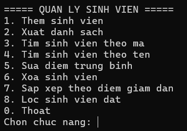

### Thêm sinh viên thành công

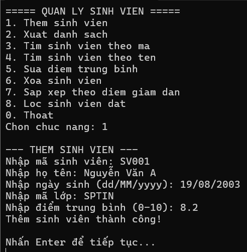

### Thêm sinh viên với mã đã tồn tại

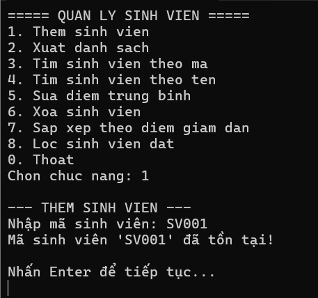

### Kiểm tra dữ liệu điểm nhập vào (âm, lớn hơn 10, hợp lệ)

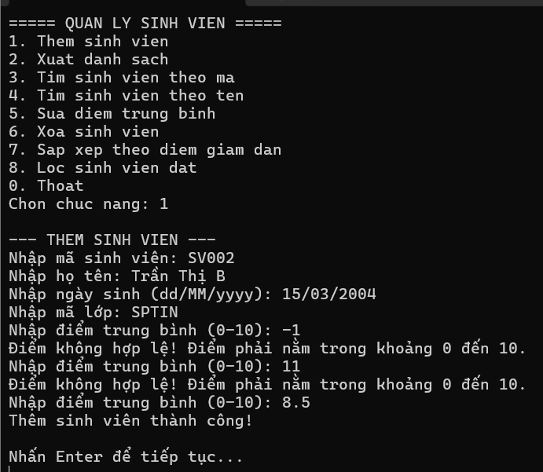

### Xuất danh sách sinh viên

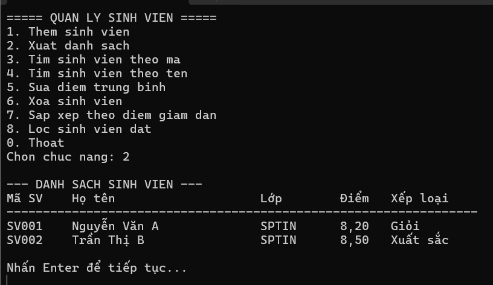

### Tìm sinh viên theo mã

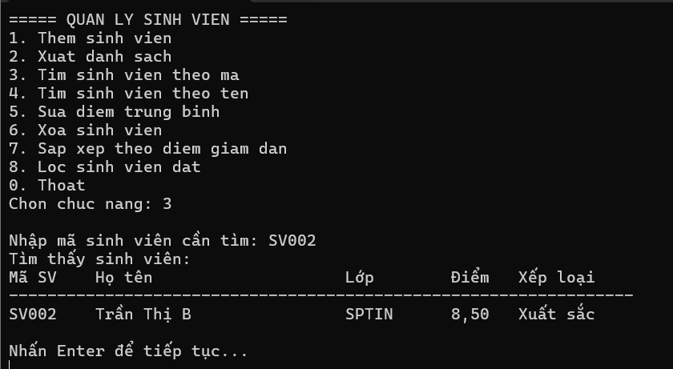

### Tìm theo mã không tồn tại

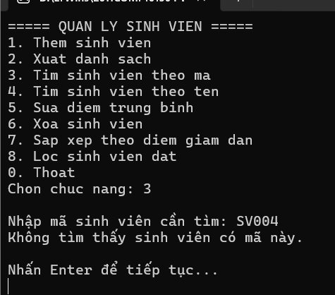

### Tìm sinh viên theo tên

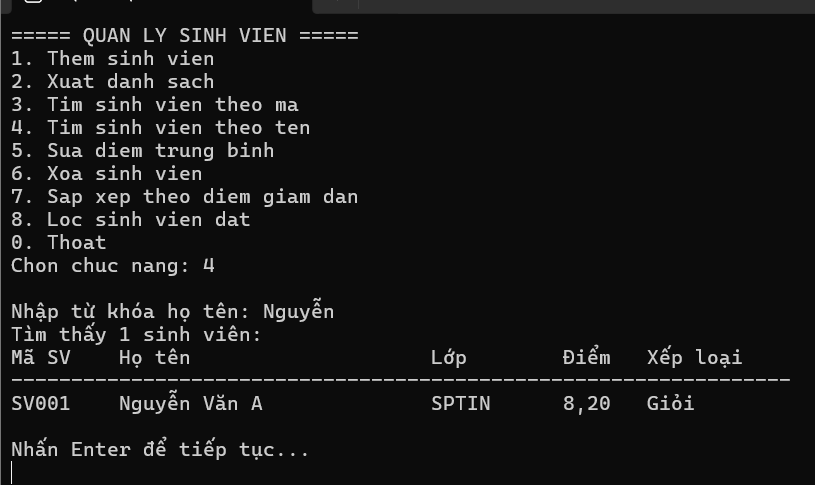

### Sửa điểm trung bình

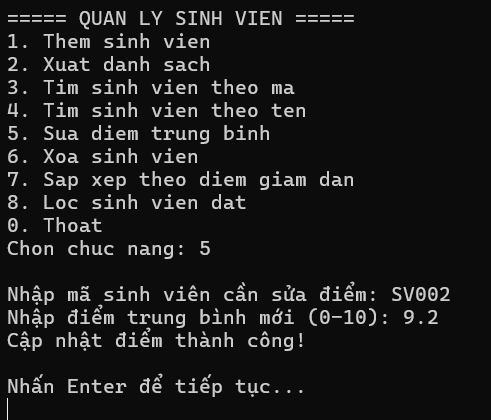

### Xóa sinh viên với mã không tồn tại

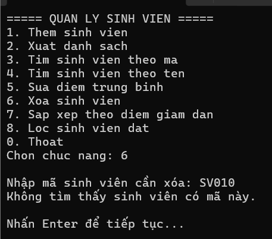

### Sắp xếp theo điểm giảm dần

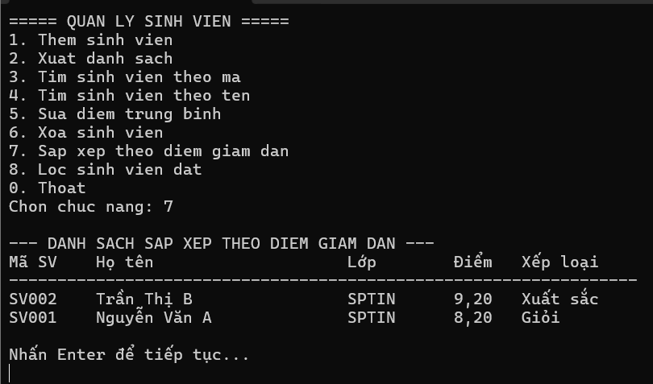

### Lọc sinh viên đạt (điểm >= 5)

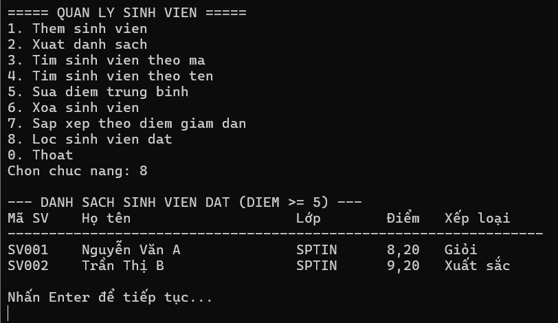

