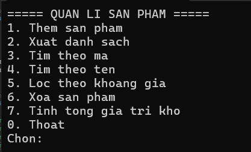
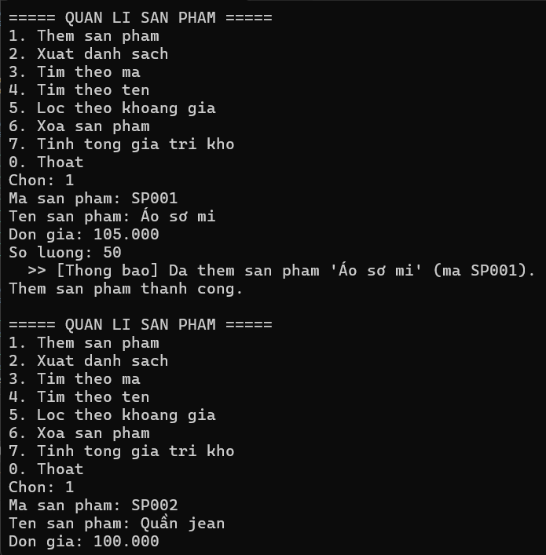
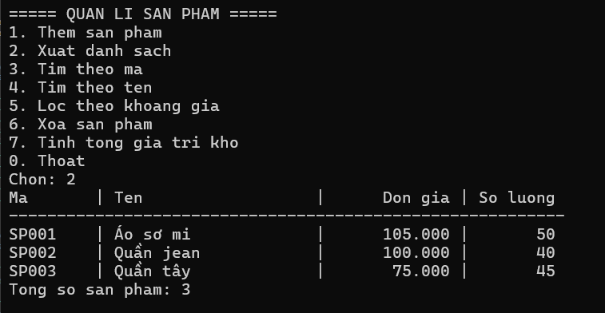
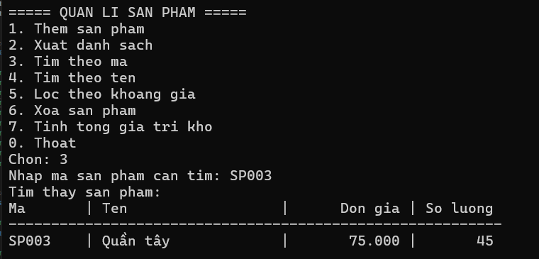
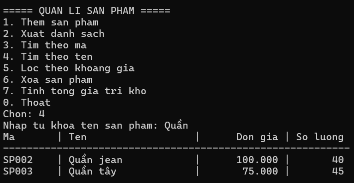
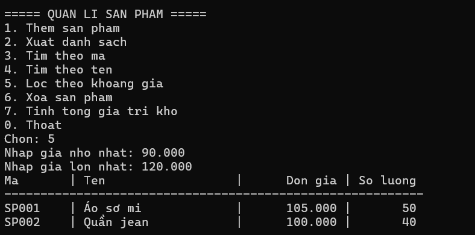
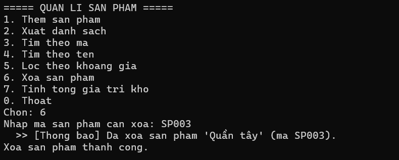
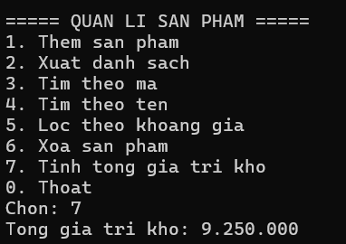
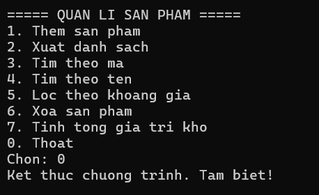

# Lab 04 - Quản lý sản phẩm (Console App)

## Thông tin sinh viên
- Họ tên: Võ Ngọc Tuyết Nhung
- MSSV: 49.01.103.058
- Lớp: 49.01.SPTIN.A

## Mô tả
Ứng dụng Console C# (.NET 8) quản lý danh sách sản phẩm trong kho, cho phép
thêm, xem, tìm kiếm, lọc theo khoảng giá, xóa sản phẩm và tính tổng giá trị
tồn kho. Dữ liệu được lưu tạm trong bộ nhớ (không dùng database) thông qua
một Repository generic.

## Công nghệ sử dụng
- C# .NET 8 (Console Application)
- Lập trình hướng đối tượng: kế thừa, generic, custom exception, event/delegate
- `Repository<T>` generic (ràng buộc bằng `IEntity`) để lưu trữ và tìm kiếm
- `Func<T, bool>` để tìm theo tên và lọc theo khoảng giá
- `event Action<string>` để thông báo khi thêm/xóa sản phẩm thành công


## Chức năng chính
1. **Thêm sản phẩm** - nhập mã, tên, đơn giá, số lượng. Dữ liệu được kiểm
   tra ngay trong constructor của `Product` (mã/tên không được để trống,
   giá và số lượng không được âm); nếu mã sản phẩm đã tồn tại sẽ báo lỗi
   trùng mã.
2. **Xuất danh sách** - in toàn bộ sản phẩm đang có trong kho ra dạng bảng.
3. **Tìm theo mã** - tìm chính xác một sản phẩm theo mã sản phẩm.
4. **Tìm theo tên** - tìm tất cả sản phẩm có tên chứa từ khóa nhập vào
   (không phân biệt hoa/thường).
5. **Lọc theo khoảng giá** - liệt kê các sản phẩm có đơn giá nằm trong
   khoảng [giá nhỏ nhất, giá lớn nhất].
6. **Xóa sản phẩm** - xóa sản phẩm theo mã; báo lỗi nếu mã không tồn tại.
7. **Tính tổng giá trị kho** - tính tổng (đơn giá x số lượng) của tất cả
   sản phẩm hiện có.
8. **Thoát** - kết thúc chương trình.

Chương trình xử lý các lỗi thường gặp (dữ liệu không hợp lệ, mã trùng,
không tìm thấy sản phẩm, sai định dạng số) và hiển thị thông báo rõ ràng
thay vì dừng đột ngột.

## Cách chạy
1. Mở file `ProductManager.sln` bằng Visual Studio (hoặc VS Code có cài
   .NET SDK 8.0 trở lên).
2. Build solution (Ctrl+Shift+B) để kiểm tra không lỗi.
3. Chạy project (F5 hoặc Ctrl+F5).


### Lưu ý khi nhập đơn giá
Chương trình dùng định dạng số kiểu Việt Nam (`vi-VN`): dấu `.` là phân
cách hàng nghìn. Ví dụ nhập `105.000` để được giá trị 105000 đồng.

```

## Hình ảnh minh họa

### Menu chính


### Thêm sản phẩm


### Xuất danh sách


### Tìm theo mã


### Tìm theo tên


### Lọc theo khoảng giá


### Xóa sản phẩm


### Tính tổng giá trị kho


### Thoát chương trình


