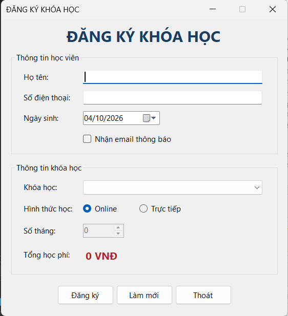
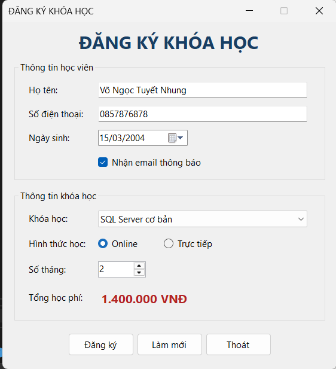
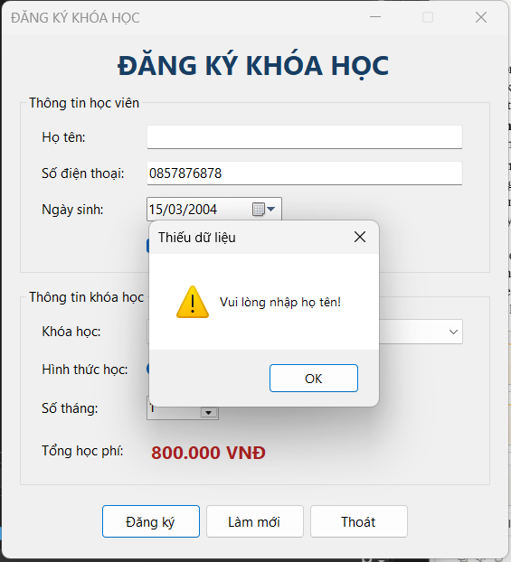
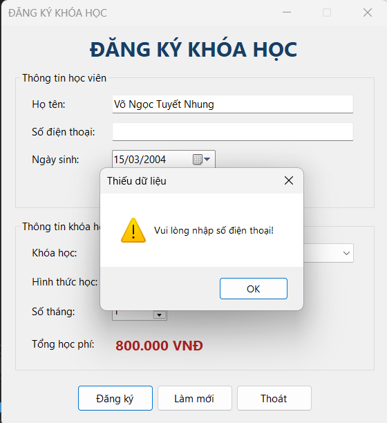
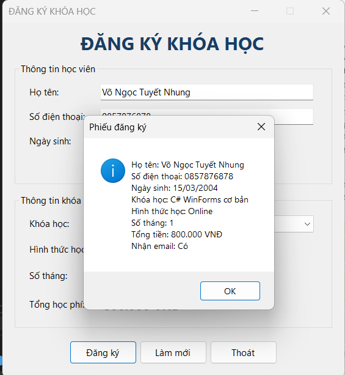
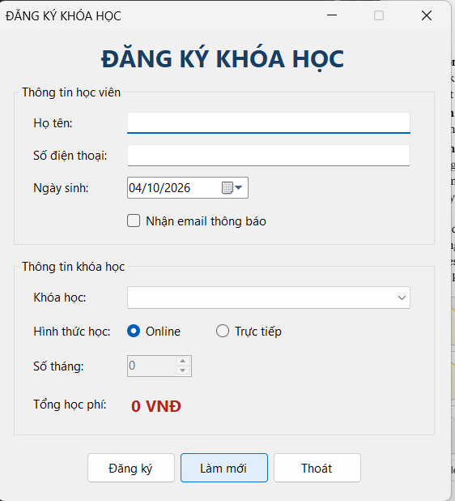
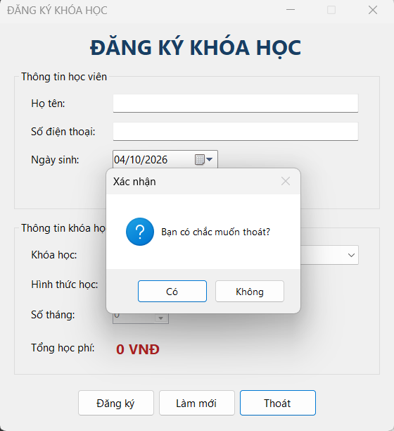

# Lab 05 - Ứng dụng đăng ký khóa học bằng Windows Forms

## Thông tin sinh viên

- Họ tên: Võ Ngọc Tuyết Nhung
- MSSV: 49.01.103.058
- Lớp: 49.01.SPTIN.A


## Mô tả

**CourseRegistrationApp** là ứng dụng Windows Forms (C#) dùng để đăng ký khóa học. Người dùng nhập thông tin học viên, chọn khóa học, hình thức học và số tháng. Ứng dụng tự tính tổng học phí và hiển thị phiếu đăng ký.

Ứng dụng chỉ xử lý dữ liệu trên Form, **không dùng cơ sở dữ liệu** nên không cần phục hồi database và không có tài khoản đăng nhập.

## Công nghệ sử dụng

- Ngôn ngữ: C#
- Nền tảng: .NET (Windows Forms App)
- IDE: Visual Studio 2022
- Control sử dụng: Label, TextBox, Button, ComboBox, RadioButton, CheckBox, DateTimePicker, NumericUpDown, GroupBox

## Chức năng

| Chức năng | Mô tả |
|---|---|
| Form Load | Nạp 4 khóa học vào ComboBox, mặc định **chưa chọn khóa học**, hình thức Online, số tháng 0, tổng học phí 0 VNĐ |
| Tính học phí tự động | Học phí = học phí 1 tháng x số tháng, cập nhật ngay khi đổi khóa học hoặc số tháng |
| Đăng ký | Kiểm tra dữ liệu rồi hiển thị phiếu đăng ký bằng `MessageBox` |
| Làm mới | Đưa toàn bộ Form về trạng thái ban đầu và đưa con trỏ về ô họ tên |
| Thoát | Hiển thị hộp thoại xác nhận, chỉ đóng Form khi người dùng chọn đồng ý |

### Quy tắc kiểm tra dữ liệu

| Trường | Quy tắc | Thông báo |
|---|---|---|
| Họ tên | Không được rỗng | Vui lòng nhập họ tên! |
| Số điện thoại | Không được rỗng | Vui lòng nhập số điện thoại! |
| Số điện thoại | Phải đúng 10 chữ số (không ít hơn, không nhiều hơn, không có chữ) | Số điện thoại phải gồm đúng 10 chữ số! |
| Khóa học | Phải chọn một khóa học trong danh sách | Vui lòng chọn khóa học! |
| Ngày sinh | Không được chọn sau ngày hiện tại | Giới hạn bằng `MaxDate` của `DateTimePicker` |
| Số tháng | Từ 1 đến 12 khi đã chọn khóa học. Chưa chọn khóa học thì bằng 0 và bị khóa | - |

Khi dữ liệu sai, ứng dụng hiển thị `MessageBox`, đưa con trỏ về ô bị lỗi bằng `Focus()` và dừng xử lý.

### Bảng học phí

| Khóa học | Học phí/tháng |
|---|---|
| C# WinForms cơ bản | 800.000 VNĐ |
| SQL Server cơ bản | 700.000 VNĐ |
| Web Frontend cơ bản | 750.000 VNĐ |
| Lập trình Python cơ bản | 650.000 VNĐ |

## Danh sách control

| Nhóm | Control | Tên control | Ghi chú |
|---|---|---|---|
| Thông tin học viên | TextBox | `txtHoTen` | Nhập họ tên |
| Thông tin học viên | TextBox | `txtSoDienThoai` | Nhập số điện thoại, tối đa 10 ký tự |
| Thông tin học viên | DateTimePicker | `dtpNgaySinh` | Chọn ngày sinh |
| Thông tin học viên | CheckBox | `chkNhanEmail` | Nhận email thông báo |
| Thông tin khóa học | ComboBox | `cboKhoaHoc` | Chọn khóa học |
| Thông tin khóa học | RadioButton | `radOnline`, `radOffline` | Hình thức học |
| Thông tin khóa học | NumericUpDown | `numSoThang` | Số tháng đăng ký |
| Thông tin khóa học | Label | `lblTongTien` | Hiển thị tổng học phí |
| Nút lệnh | Button | `btnDangKy`, `btnLamMoi`, `btnThoat` | Đăng ký, Làm mới, Thoát |
| Gom nhóm | GroupBox | `grpHocVien`, `grpKhoaHoc` | Hai nhóm thông tin |

Thứ tự phím Tab đi từ trên xuống dưới, từ trái sang phải.

## Cách chạy

1. Cài **Visual Studio 2022** với workload **.NET desktop development**.
2. Clone repository:
   ```
   git clone <đường-dẫn-repository>
   ```
3. Mở file `.sln` ở thư mục gốc bằng Visual Studio.
4. Chọn **Build > Build Solution** (Ctrl + Shift + B).
5. Nhấn **F5** để chạy chương trình.


## Hình ảnh minh họa

### Giao diện chính khi mở chương trình

Chưa chọn khóa học nên số tháng bằng 0 (bị khóa) và tổng học phí là 0 VNĐ.



### Học phí thay đổi theo khóa học và số tháng

Chọn "SQL Server cơ bản" với 2 tháng: 700.000 x 2 = 1.400.000 VNĐ.



### Cảnh báo chưa nhập họ tên



### Cảnh báo chưa nhập số điện thoại



### Hiển thị phiếu đăng ký



### Giao diện sau khi bấm Làm mới



### Hộp thoại xác nhận khi thoát



## Kết quả kiểm thử

| Trường hợp | Kết quả mong đợi | Kết quả |
|---|---|---|
| Mở Form | Chưa chọn khóa học, số tháng 0, tiền 0 VNĐ | Đạt |
| Bỏ trống họ tên rồi Đăng ký | Cảnh báo, con trỏ về ô họ tên | Đạt |
| Bỏ trống số điện thoại rồi Đăng ký | Cảnh báo, con trỏ về ô số điện thoại | Đạt |
| Số điện thoại thiếu hoặc thừa số, hoặc có chữ | Cảnh báo phải đủ 10 chữ số | Đạt |
| Chưa chọn khóa học rồi Đăng ký | Cảnh báo chọn khóa học | Đạt |
| Đổi khóa học hoặc số tháng | Tổng học phí cập nhật đúng | Đạt |
| Nhập đủ dữ liệu hợp lệ rồi Đăng ký | Hiển thị phiếu đăng ký đúng | Đạt |
| Bấm Làm mới | Form về trạng thái ban đầu | Đạt |
| Bấm Thoát | Hỏi xác nhận, chỉ đóng khi đồng ý | Đạt |